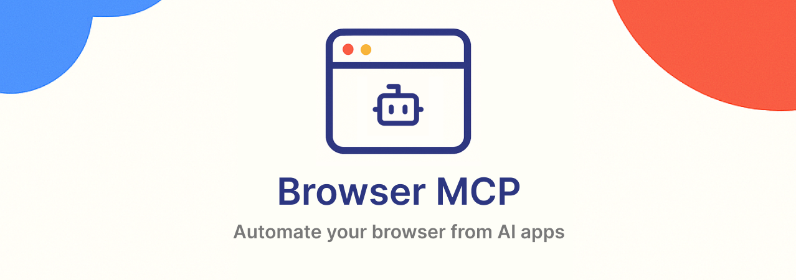

<a href="https://browsermcp.io">
  
</a>

<h3 align="center">Browser MCP</h3>

<p align="center">
  Automate your browser with AI.
  <br />
  <a href="https://browsermcp.io"><strong>Website</strong></a> 
  •
  <a href="https://docs.browsermcp.io"><strong>Docs</strong></a>
</p>

## About

Browser MCP is an MCP server + Chrome extension that allows you to automate your browser using AI applications like VS Code, Claude, Cursor, and Windsurf.

## Features

- ⚡ Fast: Automation happens locally on your machine, resulting in better performance without network latency.
- 🔒 Private: Since automation happens locally, your browser activity stays on your device and isn't sent to remote servers.
- 👤 Logged In: Uses your existing browser profile, keeping you logged into all your services.
- 🥷🏼 Stealth: Avoids basic bot detection and CAPTCHAs by using your real browser fingerprint.

## Authentication

Browser MCP now supports authentication using a user-generated token (up to 64 characters). This token must be set both on the server and in the browser extension.

### Setting the Token

- **On the server:**
  - Pass the token as a CLI argument: `--token <your-token>`
  - Or set the environment variable: `BROWSER_MCP_AUTH_TOKEN=<your-token>`
- **In the browser extension:**
  - After enabling the extension, you will be prompted to enter the same token. Enter the exact token you used for the server.

### How it works
- The browser extension will send the token to the server when connecting.
- The server will only accept connections and requests from extensions that provide the correct token.
- If the token is missing or incorrect, the connection will be rejected.

**Note:**
- The token can be any string up to 64 characters. It is recommended to use a strong, random value.
- Keep your token secret. Anyone with access to the token can control your browser via Browser MCP.

## Setting Environment Variables for Chrome (Browser Extension)

To allow the Browser MCP Chrome extension to read your authentication token, you may need to set an environment variable for Chrome. This is especially useful if the extension is configured to read the token from your environment.

### On macOS/Linux:

1. Open your terminal.
2. Start Chrome with the environment variable set:
   
   ```sh
   BROWSER_MCP_AUTH_TOKEN=<your-token> open -a "/Applications/Google Chrome.app"
   ```
   Or, if you use `google-chrome` from the command line:
   ```sh
   BROWSER_MCP_AUTH_TOKEN=<your-token> google-chrome
   ```

### On Windows:

1. Open Command Prompt (cmd.exe).
2. Run:
   ```cmd
   set BROWSER_MCP_AUTH_TOKEN=<your-token>
   start chrome
   ```

> **Note:**
> Replace `<your-token>` with your actual token. This ensures Chrome (and the extension) can access the token from the environment.

## Example: MCP Client Configuration

To use Browser MCP with an MCP-compatible client (such as Cursor, VS Code, or other tools), add the following to your MCP client configuration file (e.g., `.mcp.json` or `settings.json`):

```json
{
  "mcpServers": {
    "browsermcp": {
      "command": "npx",
      "args": ["@browsermcp/mcp@latest", "--token", "<your-token>"]
    }
  }
}
```

- Replace `<your-token>` with your chosen authentication token (up to 64 characters).
- This will ensure the MCP client starts the Browser MCP server with the correct token.

## Extension Options: Token and Port Override

The Browser MCP Chrome extension now includes an options page where you can:
- Set your authentication token (up to 64 characters).
- Set a port override (if you want to use a port other than the default 9234).

To access the options page:
1. Go to `chrome://extensions/` in Chrome.
2. Find "Browser MCP" and click "Details".
3. Click "Extension options" or "Options".
4. Enter your token and (optionally) the port, then save.

The extension will use these settings for all future connections.

## Extension Capabilities

The extension now reports its capabilities to the server and clients, including:
- Extension name and version
- Supported features: `token-auth`, `port-override`, `capabilities-report`

You (or your client) can request these capabilities via a message to the extension, or they will be sent automatically after authentication.

## Example: MCP Client Configuration (with Port Override)

If you want to specify a custom port, update your MCP client configuration as follows:

```json
{
  "mcpServers": {
    "browsermcp": {
      "command": "npx",
      "args": ["@browsermcp/mcp@latest", "--token", "<your-token>", "--port", "<your-port>"]
    }
  }
}
```
- Replace `<your-token>` with your authentication token.
- Replace `<your-port>` with your chosen port (if overriding the default).

If you do not specify a port, the default (9234) will be used.

## Contributing

This repo contains all the core MCP code for Browser MCP, but currently cannot yet be built on its own due to dependencies on utils and types from the monorepo where it's developed.

## Credits

Browser MCP was adapted from the [Playwright MCP server](https://github.com/microsoft/playwright-mcp) in order to automate the user's browser rather than creating new browser instances. This allows using the user's existing browser profile to use logged-in sessions and avoid bot detection mechanisms that commonly block automated browser use.
